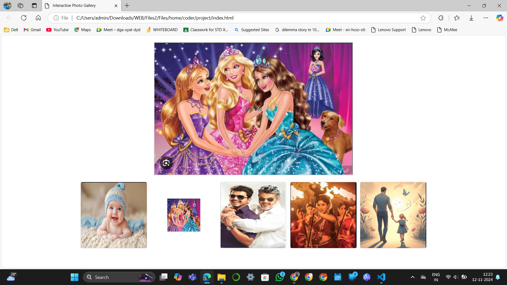

# EX-7 Interactive-gallery
## Date: 12-11-2024

## AIM:
To design a book front cover page using HTML and CSS.

## DESIGN STEPS:
Step 1:
Create a Django Admin project.

Step 2:
Create an app in the Django interface.

Step 3:
Create a folder named 'static' in the app folder.

Step 4:
Create a new HTML file in the static folder.

Step 5:
Write the HTML code with relevant CSS properties.

Step 6:
Choose the appropriate style and color scheme.

Step 7:
Insert the images in their appropriate places.

Step 8:
Publish the website in the LocalHost.

## PROGRAM:
```
HTML

<!DOCTYPE html>
<html lang="en">
<head>
    <meta charset="UTF-8">
    <meta name="viewport" content="width=device-width, initial-scale=1.0">
    <title>Interactive Photo Gallery</title>
    <link rel="stylesheet" href="style.css">
</head>
<body>

    <div id="image">Hover over an image below to display here.</div>

    <div class="gallery">
        
        
        
        
        
    </div>

    <script src="script.js"></script>
</body>
</html>
```
```
CSS

/* style.css */
#image {
    width: 600px;
    height: 400px;
    border: 2px solid #ccc;
    display: flex;
    align-items: center;
    justify-content: center;
    font-size: 1.2em;
    background-color: #f7f7f7;
    color: #555;
    text-align: center;
    background-size: cover;
    background-position: center;
    transition: background-image 0.3s ease-in-out;
    margin: 20px auto;
}

.gallery {
    display: flex;
    justify-content: center;
    gap: 10px;
}

.gallery img {
    width: 200px;
    height: 200px;
    cursor: pointer;
    transition: transform 0.2s ease;
    border: 1px solid #ddd;
    border-radius: 5px;
}

.gallery img:hover {
    transform: scale(1.1);
    border-color: #888;
}
```
```
JAVASCRIPT

// script.js

// Reference to the image container
const imageDiv = document.getElementById('image');
const originalImageUrl = ''; // Leave empty if no background image
const originalText = "Hover over an image below to display here."; // Original text

function upDate(previewPic) {
    // Check if previewPic.src is valid
    if (!previewPic.src) {
        console.error("Image source not found for:", previewPic);
        return;
    }
    
    // Set background image and text to previewPic's src and alt attributes
    imageDiv.style.backgroundImage = `url('${previewPic.src}')`;
    imageDiv.innerHTML = previewPic.alt;
}

function unDo() {
    // Reset background image and text
    imageDiv.style.backgroundImage = `url('${originalImageUrl}')`;
    imageDiv.innerHTML = originalText;
}
```

## WEBSITE URL:
```
https://raja-harini.github.io/interactive-gallery/
```

## OUTPUT:



## RESULT:
The program for designing book front cover page using HTML and CSS is completed successfully.